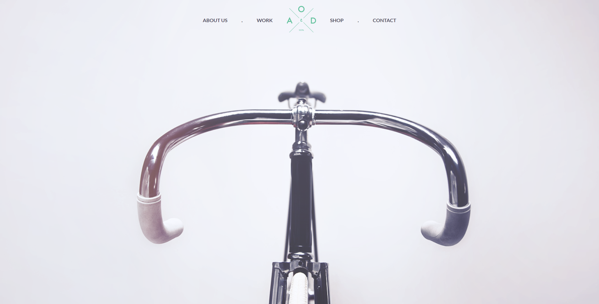

# AOD

📄 **aod** - это мой второй проект в верстке, для закрепления изученного материала. Одностраничный сайт - лэндинг, с отзывчиво адаптивной версткой. И с использованием _grid_ сетки для позиционирования элементов страницы. Создан по макету предоставленному в открытом доступе: [freebiesbug](https://freebiesbug.com/psd-freebies/bicycle-flat-one-page-template).

---

## about:

📑 Первоначально проект был нужен для практики в верстке страниц с помощью _grid_, но в процессе я случайно наткнулся на препроцессор **Pug** и решил опробовать его в деле, комбинируя уже с ранее знакомым **SASS**.

- 📝 Краткий очерк по проделанной работе:
  - Первая практика использования препроцессора **Pug** для **HTML5**;
  - Закрепление опыта в использовании препроцессора **SCSS** для **CSS3**;
  - В том числе и использования _grid_ сетки для всей страницы;

---

## warning:

> 📌 _Работа над проектом прекращена:_
>
> > **aod** _- это просто практика в верстке. Проект без использования **JavaScript**._
>
> **P.s.** _спасибо за ознакомление с работой_ 👋

---

<h1 align="center"><a href="https://lapard1n.github.io/aod">aod:</a></h1>

---
